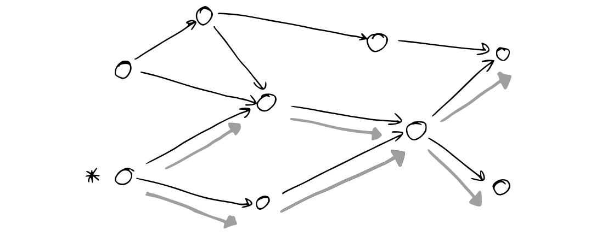
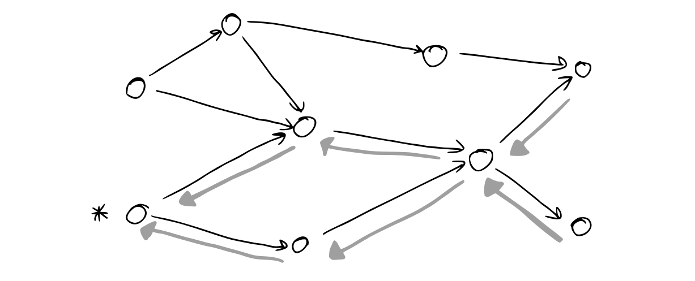
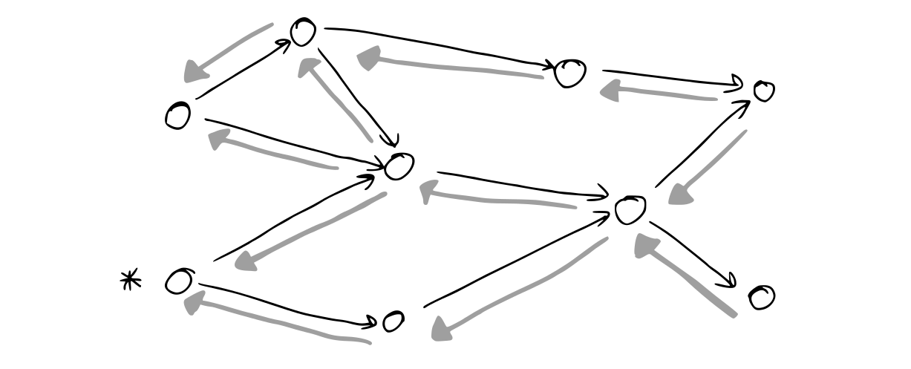
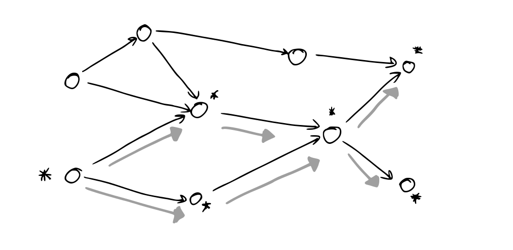
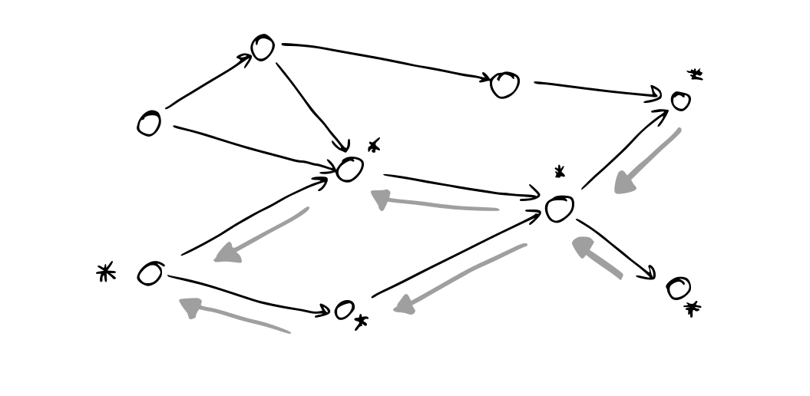

+++
title = "Pushing and Pulling: Three Reactivity Algorithms"
date = 2026-01-19
tags = ["programming", "design-patterns", "reactivity"]
slug = "reactivity-algorithms"
draft = true
[params.cover]
name = "No. 2"
artist = "Will Henry Stevens"
date = "1939"
institution = "Smithsonian American Art Museum"
institution-url = "https://americanart.si.edu/"
+++

It's looking like I'm going to need to build a reactive engine for work, so I'm going to prepare for that by writing down what I know about them. I want to look at three ways of building reactive engines: push reactivity, pull reactivity, and the hybrid push/pull combination that is used in a bunch of web frameworks.

## The Problem Statement

The simplest way to visualise reactivity, in my opinion, is as a spreadsheet. You have a series of input cells, containing your initial data, and a series of output cells containing the final results. In between are many more cells containing intermediate computations that need to be done to figure out the final results.

<picture>
    <source media="(prefers-color-scheme: dark)"
                type="image/svg+xml"
                srcset="./overview-dark.svg">
    <source media="(prefers-color-scheme: light)"
                type="image/svg+xml"
                srcset="./overview.svg">
    
</picture>

When one of the input cells changes, all the cells that depend on it need to react to that change — the aforementioned reactivity. In practice, though, this is the bare minimum requirement. When building reactive systems, there are usually some additional requirements we impose that make the problem harder:

1. Each cell is recalculated at most once. We don't do any calculations that are immediately discarded. ("Efficient")
2. We only update cells that actually need to be updated. Any cells that aren't affected by the input are left untouched. ("Fine-grained")
3. Whenever cells change, all the cells change at the same time. There's never a moment when an intermediate computed value has updated, but the output cell is still showing a result based on the previous input. ("Glitchless")
4. Each time a node is updated, it may dynamically add or remove dependencies ("Dynamic")

The first two requirements ("Efficient" and "Fine-grained") are important for performance. Imagine a large spreadsheet with millions of cells containing formulas — it would be a huge waste of resources to recalculate every single cell, every time any input changes. Similarly, you don't want to calculate the value of a cell multiple times if you can help it. In general, we want to do the minimum amount of work possible.

The third requirement ("Glitchless") is important for correctness. We don't want intermediate states to be observable — if this were possible, then we can end up with invalid states. Consider two neighbouring cells, one that contains a country's ISO country code (UK, DE, BE, etc), and another that contains the full name of that country. We don't want to be able to observe the state where the two cells are out-of-sync with each other.

The fourth requirement ("Dynamic") is ensures that we only create dependencies when they are actually needed. This is easiest to see with conditional formulas, so something like `IF(<condition>, slow_calculation(B1))`. If the condition is true, this formula returns the value of (and therefore depends on) the cell B1. But if the condition is false, the formula returns nothing — and if B1 changes, this cell should not be updated. This is a dynamic dependency — the dependency only exists if `<condition>` is true.

These requirements will hopefully become more clear as we start trying out different algorithms, and seeing examples of their successes and failure modes. Before we get too deep in the weeds, though, I want to emphasise that not all reactive systems are the same, and some don't need all of these requirements. For example, lots of simple reactive systems work just fine with static dependencies only, trading off some efficiency wins for implementation simplicity. Similarly, glitches are only important if they are actually observed, so some reactive systems will be glitch-y by default, but provide tools for syncing nodes together if the user actually needs them to be in sync.

But for the sake of this article, let's assume we need all these things and look at some approaches to implementing reactivity.

## Push-Based Reactivity

In push-based reactivity, when a node updates, it notifies (and updates) all of its dependents. We can visualise this as the update being pushed down the chain of dependencies, until it reaches the final node to be updated.

<picture>
    <source media="(prefers-color-scheme: dark)"
                type="image/svg+xml"
                srcset="./push-dark.svg">
    <source media="(prefers-color-scheme: light)"
                type="image/svg+xml"
                srcset="./push.svg">
    
</picture>

This is a simple, and therefore very common approach. Generally, most event systems, streams, and observables follow this rough pattern. Even promises/futures/async/await can be thought of as a one-time-only push-based reactive tree — each `.then`/`.map`/`await` call creates a listener to the previous step, and then when the initial promise resolves, the update is pushed through the rest of the system.

The single biggest advantage of push-based reactivity is that it is fine-grained. Each time an input changes, we only notify those dependencies that will actually need to be updated. Every other node in the system can remain in a state of blissful ignorance. This is great if we've got a lot of inputs that update independently from each other — our spreadsheet is a good example here, as are most GUIs.

However, push-based systems typically are not particularly efficient, and it's only with additional work that we can fix that. Let's look at an example of a graph that creates unnecessary work.

<picture>
    <source media="(prefers-color-scheme: dark)"
                type="image/svg+xml"
                srcset="./fail-case-dark.svg">
    <source media="(prefers-color-scheme: light)"
                type="image/svg+xml"
                srcset="./fail-case.svg">
    
</picture>

According to our push-based system, we update the first node in our graph (A). This pushes a signal to (A)'s dependents that they should now update. In this case, both (B) and (C) update. However, (B) depends on both (A) and (C), so when (C) updates, (B) needs to update again, and we discard any previous work we've done there. Similarly, based on just a single update to (A), (D) will receive three different signals to update.

We can improve this somewhat if we make sure we always perform updates in a particular order. Consider a different approach to the same graph above:

1. We update (A), and push a signal to (B) and (C) to update.
2. (B) delays updating for now, knowing there are other dependencies to update first. Meanwhile, (C) updates, and pushes a signal on to (B) and (D).
3. (B) now updates, as both (A) and (C) are now ready. Once finished, it pushes a signal on to (D).
4. (D) updates last of all.

In this version, each node only updates once. We could do this, because we could see the entire dependency graph, and calculate the optimum route[^topological-sort] through it. If we know the entire graph, we can always calculate the optimum route, but it's not always a given that we will know the entire graph.

Part of the value of push-based systems is that each node only needs to keep track of its own dependencies and dependents, which makes analysing each node locally easy, but analysing the system as a whole hard. In the extreme case, you might dynamically create and destroy nodes in the tree depending on previous values — this doesn't make sense for our spreadsheet analogy, but is essentially what's happening with RxJS's `switchMap` operator. Essentially, the more dynamism we want in our system, the harder it is to achieve efficient updates, and the more we want efficient updates, the more we need to specify our dependency graphs up-front.

[^topological-sort]: This is known as a topological sort — a way of sorting a graph such that we visit all nodes exactly once, and we always visit a node's dependencies before we visit this graph.

The other challenge for push-based reactivity is glitches. As I mentioned earlier, glitches are when we can observe two nodes being out of sync with each other. In push-based reactivity, this is very easy to achieve — any code that runs after the first node has been updated, but before the final node has been updated has the opportunity to "see" glitches.

We can avoid this in two ways. Firstly, we can declare that any code that observes two nodes must depend on those nodes, and then apply the topological sort we described earlier. Alternatively, we can declare that any code that might be able to observe two nodes can only be run after all nodes have finished running[^depends-on-all]. These both work, but again they require us to be able to observe the full dependency tree and topologically sort all nodes.

[^depends-on-all]: Essentially, we wrap all observing code in a special node that depends on all other nodes, and therefore must always be updated last.

The other problem is that in practice, it's surprisingly easy to write code that implicitly observes some state without having the proper dependencies, at which point glitches appear again. There's typically no easy way to fully prevent these cases from cropping up, so some amount of vigilance is required to make sure everything is working.

## Pull-Based Reactivity

If what we've described above is push-based reactivity, we can draw a diagram of everything happening in reverse and call it pull-based reactivity. But that doesn't necessarily give us an intuition for what pull-based reactivity actually is.

<picture>
    <source media="(prefers-color-scheme: dark)"
                type="image/svg+xml"
                srcset="./pull-dark.svg">
    <source media="(prefers-color-scheme: light)"
                type="image/svg+xml"
                srcset="./pull.svg">
    
</picture>

In push-based reactivity, once a node has finished updating, it calls its dependents. In pull-based reactivity, therefore, we would expect each node to call its dependencies. And because you need your dependencies to update before you can update, we can see how this works: each node updates all of its dependencies, and then updates its own value.

In essence, pull-based reactivity is basically just a stack of function calls. I call a function, and it calls more functions if it needs to, then it returns a result. I can nest these functions recursively as much as I need, and the dependencies will all automatically be calculated for me.

This isn't quite reactive yet though. We still need some way of triggering the functions to be re-run when state changes.

The easiest possible system is that we just re-run everything. Going back to our spreadsheet, every time we update a cell, we go through every cell in the sheet and calculate its value fresh. When a cell references another cell (e.g. `=B8`), we first calculate the value of the dependency, then carry on calculating the initial cell's value. Eventually, we will recursively have updated every cell in the sheet.

You may be able to see some problems with this system, but let's put those to one side for now, and look at why we might want this kind of system.

The first benefit is that it's a lot easier to make our code glitchless. Every time we change the input, we make one recursive pass over all nodes, updating them to their new values. As long as we don't change the input during that pass, all of the nodes will see inputs that are consistent with each other. In single-threaded runtimes like JavaScript, this condition is very easy to achieve, and even if we introduce concurrency, we only need simple locking primitives to ensure that we wait until the pass is finished before making changes to the inputs.

The second benefit is that we get dynamic dependencies for free. If pull-based reactivity is just a call stack, then it's very easy to conditionally call (i.e. conditionally depend on) some input. We don't need to maintain an internal list of which dependencies a node is subscribed to or vice versa, we just fetch values as needed.

But there are problems — in fact, there are two big ones that mean this approach tends to work best in very specific circumstances.

The first problem is wasted work again. If cell A1 references B8, and cell A2 _also_ references B8, then when we update all the cells, we still only want to evaluate B8 once, and then reference it in both A1 and A2. We can do this through caching — whenever we calculate a cell's value, we store it somewhere, and then all future cell references can used the stored value instead of recalculating.

I'm not going to go into the depths of caching in pull-based reactivity, but as the famous aphorism reminds us, one of the hardest things in computer science is cache invalidation. And typically, the more efficient a cache is at reducing work, the harder cache invalidation becomes. So an easy approach might be generation counters, where every time we change any input, all cached values are invalidated immediately, and a harder approach might be an LRU cache of all a node's dependencies where we need to consider how many entries to cache, and how to determine equality[^multiple-cache-types].

[^multiple-cache-types]: And of course, you can mix and match these caching strategies within the same graph. One node might be entirely trivial to calculate, and not worth caching at all, while another might require the most heavy-duty caching you can get your hands on. Some nodes might need to always be up-to-date, but maybe others can take a stale-while-revalidate approach (being wary of glitches in that case!).

However, there is a second problem to deal with. Right now, we don't know which cells are actually going to change, so we're updating all of them. The actual pull-reactivity diagram probably looks something more like this:

<picture>
    <source media="(prefers-color-scheme: dark)"
                type="image/svg+xml"
                srcset="./pull-corrected-dark.svg">
    <source media="(prefers-color-scheme: light)"
                type="image/svg+xml"
                srcset="./pull-corrected.svg">
    
</picture>

Ideally, we'd only update the cells that change, and leave the rest alone. Unfortunately, this turns out to be surprisingly hard.

We can change the problem a bit. React, for example, uses a pull-based reactivity system, but can isolate certain components in the rendered tree and say "only this component and all its children should update". I want to look a bit more into how that works in a future blog post, but the main idea is that the VDOM structure returned by components ensures that a dependent node (i.e. a child component) can only affect its parent in limited ways.

In general, though, we can't solve this problem with pull-only reactivity. The input node that gets updated just doesn't have the information to tell us what its dependants are, and therefore what output nodes are eventually going to need to change. But we could try a different approach, where we do try and store that information. A combination of pushing and pulling — some kind of ~~suicide squad~~ push-pull reactivity?

## Push-Pull Reactivity

Push-pull reactivity is so named because it does both things: first we push, and then we pull. However, rather than doing the same thing twice, our push and our pull will have different purposes.

Let's start with pushing. Consider a tree of nodes. If we update one of the input nodes, our goal now is to find out which child (and output) nodes need to be updated. We're not actually going to do the updating, we're just going to find out which ones need updating.

<picture>
    <source media="(prefers-color-scheme: dark)"
                type="image/svg+xml"
                srcset="./push-pull-dark.svg">
    <source media="(prefers-color-scheme: light)"
                type="image/svg+xml"
                srcset="./push-pull.svg">
    
</picture>

We can do this by adding a boolean `dirty` flag to each node. If it's set to true, then this is a node that needs to be recalculated. Otherwise, it's up-to-date. Let's start with these flags all set to false — we have an up-to-date tree. Now, when we update the input node, we can iterate over all the children of that node, and follow a simple algorithm:

1. If the current node is already marked dirty, we don't need to do anything and can skip it.
2. We mark the current node as dirty.
3. If the node is an _output_ node, we add it to a list of outputs that need to be updated[^outputs].
4. Otherwise, we recursively visit all the children of the current node and apply this same algorithm to them.

[^outputs]: For our spreadsheet example, this step just generates a list of all dirty nodes, because every node (i.e. cell) is kind of an output node and an input node at the same time. In that case, you'd probably instead create a list of all nodes with no children. However, in a GUI framework, you might have "effect" nodes that are responsible for updating UI components — these are also leaves in the tree, but they're specifically _output_ leaves, because they form the observable part of our reactivity graph. This also means that an intermediate node that has no output won't ever end up in this list, and therefore won't get updated. This is something I'll write about more in a follow-up post!

Eventually, we'll have a tree with mixed dirty and clean nodes, where only the dirty nodes need updating. Importantly, unlike the original push-based reactivity, the order that we visit the nodes isn't important[^try-it-out]. This means we don't need to figure out the optimal path through the entire tree, and can use a simpler recursive algorithm, as long as we make sure to skip any nodes that were already marked as dirty.

[^try-it-out]: If you're not convinced by this, try it out. Use the diagram from the push-based reactivity section and try out the dirty algorithm in any order you like. You can even try out the difference between depth-first and breadth-first versions of the algorithm — it'll change the order of the nodes you visit, but you'll still visit all of them exactly once.

<picture>
    <source media="(prefers-color-scheme: dark)"
                type="image/svg+xml"
                srcset="./push-pull-2-dark.svg">
    <source media="(prefers-color-scheme: light)"
                type="image/svg+xml"
                srcset="./push-pull-2.svg">
    
</picture>

Now let's try pulling. Last time, one of the issues with pull-based reactivity was that we didn't know which nodes needed to be updated. But now we do know that — any dirty output node needs to be updated. We even made a list of these nodes while we were marking the nodes as dirty!

So now, for every one of those output nodes, we do the same thing we were doing in the pull step. But we add a couple of additional checks to our logic:

- If the node we're looking at is _clean_, we return the value of that node. We know that the existing value doesn't need to be recalculated because it's not been marked as dirty, so it's not downstream of any changed inputs.
- If the node we're looking at is _dirty_, we calculate the result, mark the node as clean, and store the calculated result alongside the node.

Once we've finished our push and our pull processes, we'll end up with an all-clean tree of nodes, and we'll have updated all of our output nodes.

Let's look at our requirements again, and see how well push-pull reactivity does.

- Efficiency: When we push, we only visit each node once. When we pull, we again only visit each node once. This is about as efficient as things can get.
- Fine-grained: When we push, we make a list of exactly the nodes that need to be updated. When we pull, we only recalculate those nodes and leave all the others alone.
- Glitchless: Because the recalculation happens during the pull step, we share the same benefits of pull-based reactivity here, which means that if we can guarantee that we don't change any input during the pull step, then the calculation must be glitchless.
- Dynamic: Pulling is always dynamic, as we discussed before. But because we don't need any global ordering of nodes, we can make the push step dynamic as well, by making it easy to register and unregister dependencies on different nodes as needed.

Nice!

## Conclusion

These are the three broad categories of reactivity system that I'm familiar with — ones where a node gets updated by a signal from above, ones where a node gets updated on demand from below, and hybrid approaches[^other-approaches].

[^other-approaches]: If you know of other approaches, please let me know! My definitions here aren't particularly rigorous, and I suspect there are other approaches, or even just alternative forms of the approaches I've described here, that have different characteristics.

For the purposes I use reactivity[^my-reactivity], push-pull reactivity is a really nice tool. The O(n) nature makes it remain fairly efficient as the size of the application grows (especially bearing in mind that the 'n' there is the number of nodes that need to be updated, which is likely to be a small subset of the total nodes in the system). It's also very easy to understand what's happening.

[^my-reactivity]: Mainly web/GUI development and more recently work on spreadsheet engines, hence all the spreadsheet examples here because that's been on my mind a lot.

That said, it's also got its issues. For example, an assumption throughout this post is that it's possible to do the entire "pull" logic in a single tick, between updates to the input nodes. If that isn't possible, you might need to convert a long-running operation into a state machine that gets updated in the background, but this can become complicated in general[^complicated].

[^complicated]: On the other hand, it can also simplify, by ensuring that the developer has to handle the various failure states that can occur with these sorts of long-running operations. For web development, where lots of processes involve asynchronous communication with a backend or waiting for user interaction, I find the state machine approach is often clearer about intent, if more verbose.

Throughout writing this, I ended up in all sorts of tangents that I've ended up deleting because they made everything too long and convoluted — I will try and put some of these tangents in a future follow-up post, because I think they're interesting.
